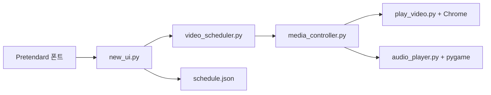

# CKBS Scheduler

학교 방송용 음악을 정해진 시간에 재생하기 위한 데스크톱 스케줄러입니다. YouTube 재생 목록, 로컬 오디오 파일, 주간 시간표를 한 화면에서 관리합니다.

<p>
  
  
  
  
</p>

## 개요

CKBS Scheduler는 반복 방송 음악을 운영하기 위한 로컬 데스크톱 앱입니다. Tkinter 운영자 UI, 주간 스케줄 파일, Selenium 기반 YouTube 재생, pygame 기반 로컬 오디오 재생을 하나의 미디어 컨트롤러로 묶었습니다.

## 주요 기능

| 영역 | 내용 |
| --- | --- |
| 스케줄링 | 요일별 시작/종료 시간 기반 재생 |
| 미디어 | YouTube URL과 로컬 오디오 파일 지원 |
| 재생 제어 | 단일 컨트롤러로 중복 재생 방지 |
| UI | Tkinter 화면과 번들 Pretendard 폰트 |
| 저장 | 스케줄과 설정을 로컬 JSON으로 유지 |
| 브라우저 재생 | YouTube 세션용 Chrome 프로필 사용 |

## 실행 흐름



## 시작하기

```bash
python -m venv .venv
source .venv/bin/activate
pip install -r requirements.txt
python new_ui.py
```

Windows에서는 다음처럼 가상환경을 활성화합니다.

```bat
.venv\Scripts\activate
```

## 레포 구조

```text
.
├── new_ui.py                 # 메인 Tkinter 앱
├── video_scheduler.py        # 스케줄 판정
├── media_controller.py       # 재생 조율
├── play_video.py             # YouTube 재생 자동화
├── audio_player.py           # 로컬 오디오 재생
├── anti_detection.py         # Chrome 실행 설정
├── font_manager.py           # Pretendard 폰트 로딩
├── schedule.json             # 로컬 스케줄 데이터
├── Pretendard-1.3.9/         # 번들 폰트 파일
└── Release/                  # 배포용 사용자 가이드와 릴리스 자료
```

## Chrome 프로필 메모

앱은 YouTube 재생을 위해 로컬 Chrome 프로필을 만들고 재사용할 수 있습니다. 브라우저 확장 프로그램과 계정별 Chrome 상태는 Git으로 공유하지 않고 각 실행 환경에서 따로 설정하는 것을 전제로 합니다.

## 패키징 메모

`CKBS_Scheduler.spec`는 PyInstaller 패키징을 위한 설정입니다. Chrome, 오디오 장치, 확장 프로그램 상태가 실행 PC에 따라 달라질 수 있으므로 배포 전 대상 장비에서 재생을 확인해야 합니다.
